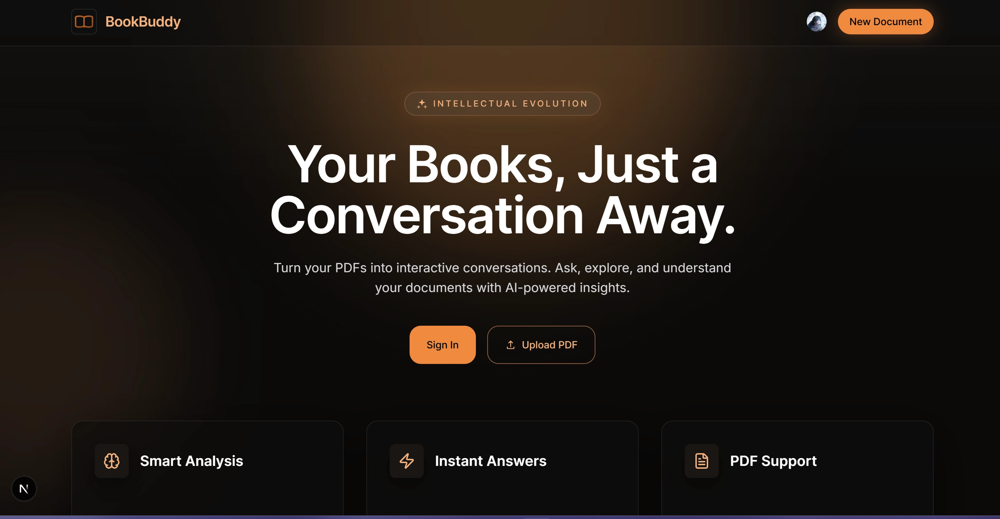
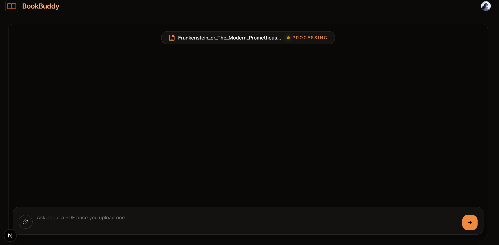
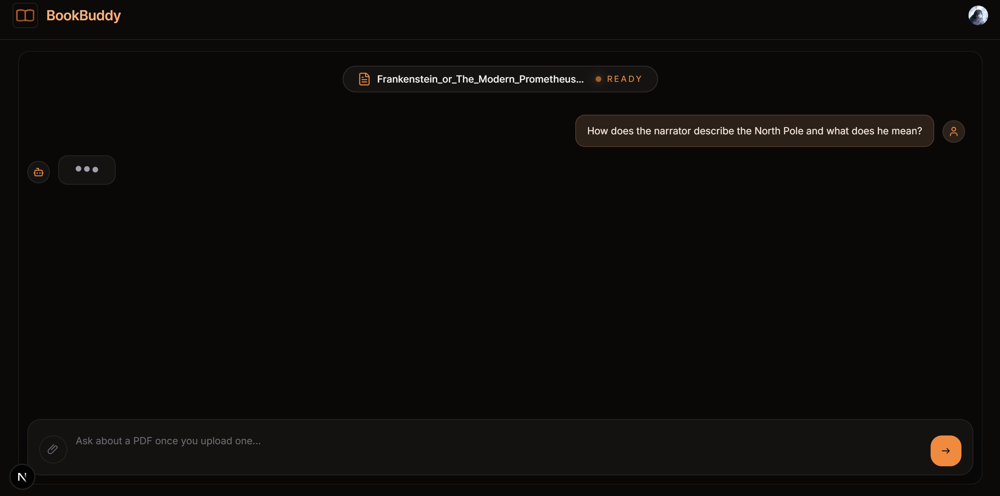
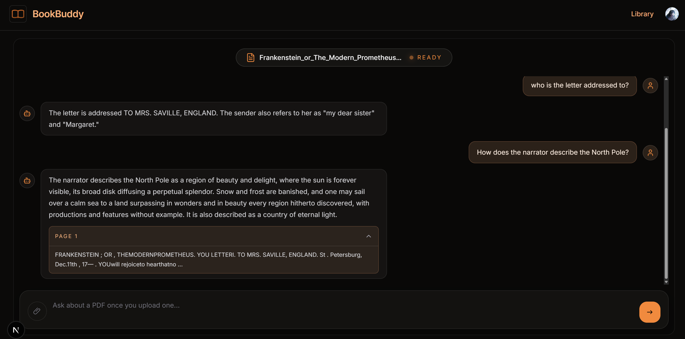
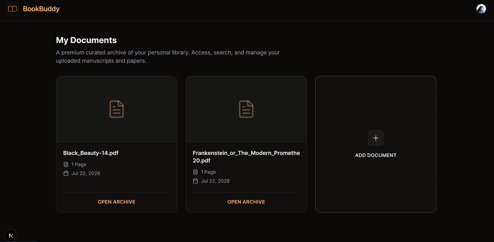

# BookBuddy

An AI-powered PDF assistant that allows users to upload documents and have intelligent conversations with them.

Built using **Retrieval-Augmented Generation (RAG)**, BookBuddy combines semantic search with **Google Gemini** to provide accurate, context-aware answers from uploaded PDFs with document-specific retrieval and source citations.

---

# Overview

BookBuddy transforms static PDF documents into interactive knowledge sources.

Users can upload books, research papers, or any PDF document and ask questions about the content. The application retrieves relevant sections from the uploaded document and uses AI to generate accurate responses with supporting sources.

The application follows a **Retrieval-Augmented Generation (RAG) pipeline**:

```
User uploads PDF
        ↓
PDF text extraction
        ↓
Text splitting into chunks
        ↓
Generate vector embeddings
        ↓
Store embeddings in Qdrant Vector Database
        ↓
Retrieve relevant document chunks
        ↓
Google Gemini generates contextual response
        ↓
Display answer with source citations
```

---

# Features

## Document Library

- View all previously uploaded documents in a personal library
- Browse uploaded books and papers in a centralized archive
- Each document stores metadata such as:
  - File name
  - Upload date
  - Number of pages

- Open any previous document and continue working instantly

---

## AI Chat With Documents

- Upload PDF documents and start conversations with them
- Ask questions about the uploaded content
- Receive AI-generated answers based only on the selected document
- Document-specific retrieval prevents information mixing between different PDFs

---

## Retrieval-Augmented Generation (RAG)

- Converts PDF content into searchable vector embeddings
- Uses semantic similarity search to find relevant document sections
- Provides context-aware responses using retrieved information
- Powered by Google Gemini for AI generation

---

## Chat History & Document Memory

- Conversations are stored separately for each document
- Reopen any book from the library and continue previous discussions
- Previous questions and AI responses are automatically restored

---

## Source Citations

- Every AI response includes supporting document sources
- Displays:
  - Page number
  - Retrieved text preview

This allows users to verify answers directly from the original PDF.

---

## Authentication

- Secure user authentication using Clerk
- Each user's uploaded documents are stored separately
- Personal document library for every account

---

## PDF Processing

- Upload and process PDF documents
- Extract text automatically
- Split large documents into searchable chunks
- Generate embeddings for efficient retrieval

---

# Tech Stack

## Frontend

- Next.js
- React
- TypeScript
- Tailwind CSS
- Clerk Authentication
- Lucide React Icons

---

## Backend

- Node.js
- Express.js
- LangChain
- Multer

---

## AI & Database

- Google Gemini API
- Gemini Embeddings
- Qdrant Cloud Vector Database
- Retrieval-Augmented Generation (RAG)

---

## Storage

- MongoDB
  - Document metadata
  - User document relationships
  - Chat history

- Qdrant
  - Vector embeddings
  - Semantic document search

---

## Deployment

Frontend:
- Vercel

Backend:
- Render

---

# Installation & Setup

## Prerequisites

Make sure you have:

- Node.js >= 18
- npm
- Google Gemini API Key
- Qdrant Cloud Account
- MongoDB Database
- Clerk Account

---

# 1. Clone Repository

```bash
git clone https://github.com/Rishitha1512/AI-Book-Buddy.git
```

---

# 2. Backend Setup

Navigate to the server directory:

```bash
cd server
```

Install dependencies:

```bash
npm install
```

Create a `.env` file:

```env
PORT=5000

GOOGLE_API_KEY=your_gemini_api_key

QDRANT_URL=your_qdrant_url

QDRANT_API_KEY=your_qdrant_api_key

MONGO_URI=your_mongodb_connection_string
```

Start backend:

```bash
npm run dev
```

---

# 3. Frontend Setup

Navigate to the client directory:

```bash
cd client
```

Install dependencies:

```bash
npm install
```

Create `.env.local`:

```env
NEXT_PUBLIC_API_URL=http://localhost:5000

NEXT_PUBLIC_CLERK_PUBLISHABLE_KEY=your_clerk_key

CLERK_SECRET_KEY=your_clerk_secret
```

Start frontend:

```bash
npm run dev
```

---

The application will run at:

```
http://localhost:3000
```

---

# Application Flow

```
User Authentication
        ↓
Upload PDF
        ↓
Create Document Entry
        ↓
Extract PDF Content
        ↓
Generate Embeddings
        ↓
Store Vectors in Qdrant
        ↓
Save Document in Library
        ↓
Open Document Chat
        ↓
Ask Questions
        ↓
Retrieve Relevant Chunks
        ↓
Generate Gemini Response
        ↓
Show Answer + Citations
```

---

# API Endpoints

## Upload PDF

### POST `/upload`

Uploads a PDF document, extracts its content, creates embeddings, stores vectors in Qdrant, and saves document metadata.

---

## Chat With Document

### POST `/chat`

Sends a question about a specific document and generates an AI response using document-specific RAG retrieval.

---

## Fetch User Documents

### GET `/documents/user/:clerkUserId`

Retrieves all documents uploaded by a specific user for the document library.

---

## Fetch Document Details

### GET `/documents/:documentId`

Retrieves information about a specific uploaded document.

---

## Fetch Chat History

### GET `/chat/:documentId`

Retrieves previous conversations associated with a specific document.










